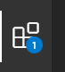
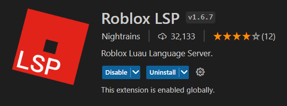

# Development Environment Setup Guide

This guide will assume you're on Windows. The setup process on MacOS may be different.

## Install Git

Git is the source control tool that makes it easy to collaborate on a project. It can be downloaded [here](https://git-scm.com/).

## Install VSCode

VSCode is the most popular code editor for Roblox development. It can be downloaded [here](https://code.visualstudio.com/).

## Install Roblox LSP Extension

* Open VSCode and go through the setup prompts. Click on the Extensions menu:

* Search for "Roblox LSP" and install it:

## Install Cargo

Cargo is the package manager for Rust, which most of our tools are built off of. We'll use it to install our toolchain manager. It can be downloaded [here](https://doc.rust-lang.org/cargo/getting-started/installation.html).

## Install Aftman

Aftman is a toolchain manager we'll use to install the rest of our tooling automatically. In VSCode, press `` Ctrl+` `` (`` Cmd+` `` on MacOS) to open a terminal and run the following command to install it:

`cargo install aftman`

## Clone Project

In the terminal, navigate to the place you'd like to store the project files using `cd`. For example:

[Windows] `cd C:\Users\username\Documents\GitHub`

Then use Git to copy the project files to your computer using the project's .git URL:

`git clone https://github.com/chipioindustries/dueling-cities.git`

## Open Project

After cloning the project, without changing the directory, open the project files in VSCode using the following terminal command:

`code dueling-cities`

This will open a new VSCode window with the project files inside of it. You can safely close the previous VSCode window.

## Install Toolchain

Open a terminal. Use Aftman to install the rest of the project's tools by running the following command:

`aftman install`

You're all set! You can learn about how to start developing with these tools on the [Development](development) page.